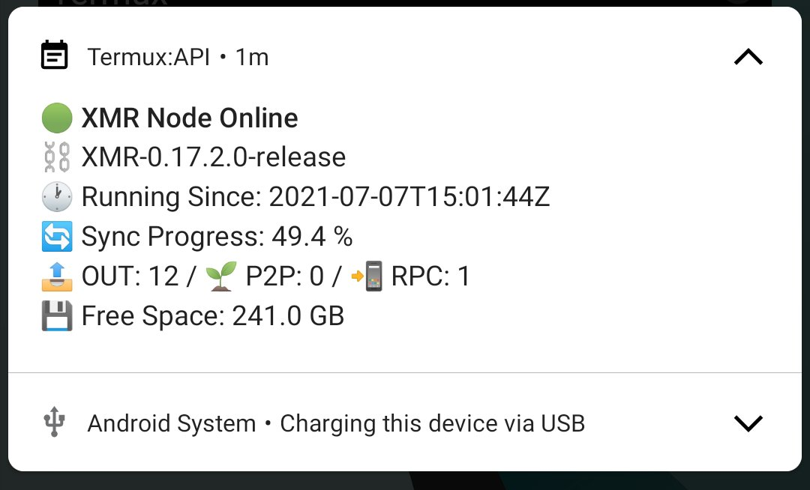
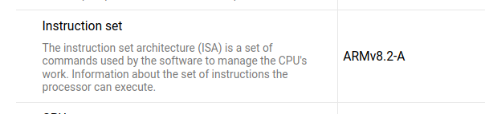
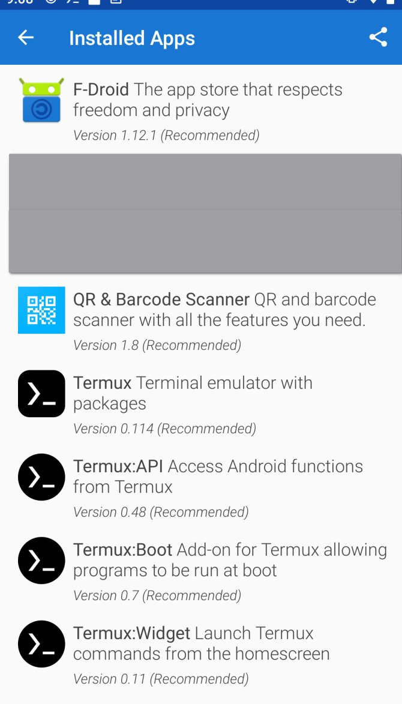
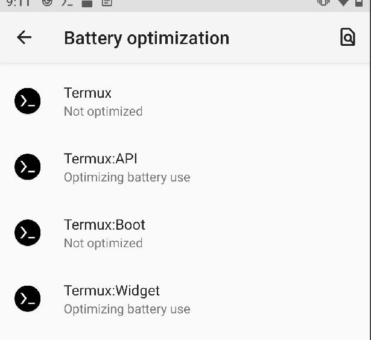
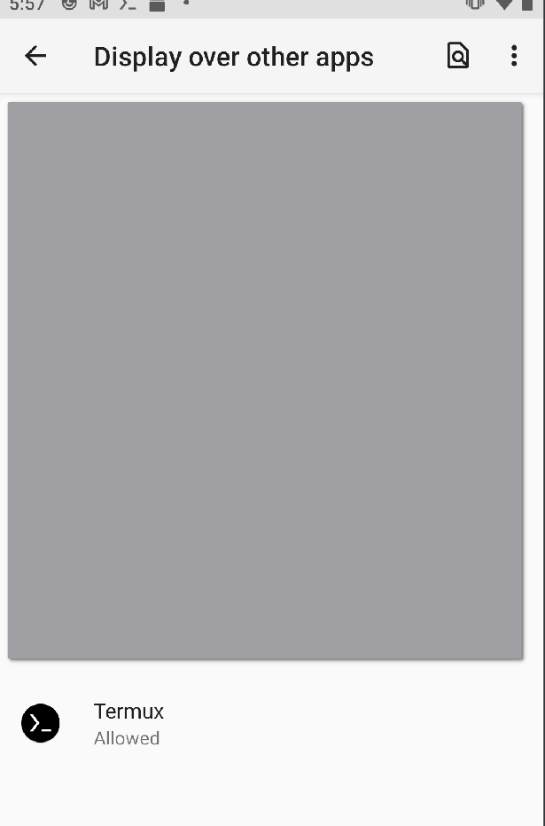
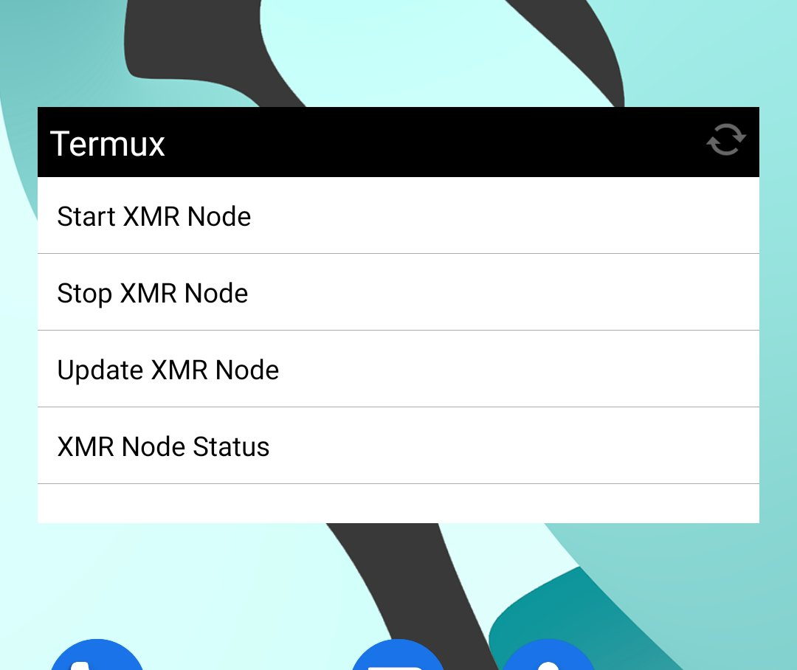
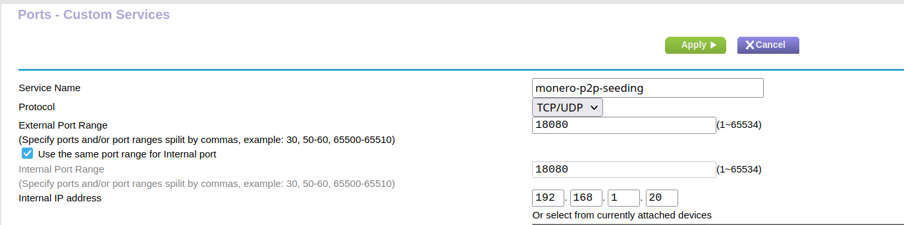
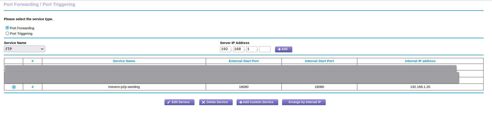

# android-termux-monero-node
Run a Full or Pruned Monero Node on Android using Termux

<center> 
<figure>

<figcaption>Monero Node Status in Android Notifications </figcaption>
</figure>
</center>

## Table of Contents
- [android-termux-monero-node](#android-termux-monero-node)
  - [Table of Contents](#table-of-contents)
- [Why](#why)
- [Contributing to the Monero Network](#contributing-to-the-monero-network)
- [WARNING...](#warning)
- [Install](#install)
- [Controls Overview](#controls-overview)
- [Connecting to your Node / Seeding the Network](#connecting-to-your-node--seeding-the-network)
  - [Wallet Connections](#wallet-connections)
  - [P2P Seeding](#p2p-seeding)
- [Updates](#updates)
- [TODO's:](#todos)
- [Donate:](#donate)

# Why

The goal of this project is to give newbs a stupid-easy way to run an energy-efficient, full or pruned Monero node with decent defaults on an Android device.... ideally, this is a few year old device that's currently sitting in a drawer doing nothing.  Why not set it up as a Monero node that sits at your house all day or you toss in a bag for making ultra-secure Monero transactions on the go?  This code and install process isn't meant for power users, people with extreme use cases, etc. If you're already that smart, you should just hack up my code and use it however you like.

Battery Life- 
I'm running this on a phone that's plugged in most of the time, so I can't speak for battery life; I would assume that once you're fully synced, the battery usage will drop quite a bit. 

Data Usage-
No idea how much data Monero uses- you'll almost certainly want to be on WiFi while it's initially syncing, and turn off the node while out and about.  My node sits on a shelf next to my wifi router.  

Running a Monero node allows you to connect CakeWallet or Monerujo to the node running in the device itself, rather than connecting to a remote node; this is a safer way of using Monero, and it alleviates network strain on the remote nodes. You should also be able to connect from other devices in your LAN


# Contributing to the Monero Network

If you simply install and run this software without making any updates in your router, you are actually LEECHING from the rest of the users of the network.  To truly contribute back to the network, open port 18080 in your router to seed (distribute) the Monero blockchain to the rest. To verify you're helping seed the network and that you've set up your router correctly, you will see  🌱 P2P: 5 (some number larger than 0)  in your Android notifications.    

While I DO recommend connecting to your Android node from within your local network using RPC, I DON'T recommend opening the RPC port in your router (yet).  

More info on running a Monero Node:

https://www.reddit.com/r/Monero/comments/kkr04n/infographic_running_a_node_which_ports_should_i/
https://www.reddit.com/r/Monero/comments/kkgly6/message_to_all_monero_users_we_need_more_public/
https://www.reddit.com/r/Monero/comments/ko0xd1/i_put_together_a_new_guide_for_running_a_monero/

# WARNING...

1. DO NOT RUN THIS ON INTERNAL ANDROID STORAGE (use microSD ONLY) OR YOU IT WILL EVENTUALLY BURN OUT (Per Howard Chu) and Run this code AT YOUR OWN RISK and READ THE CODE (and feel free to reach out if you have any improvements 😜).  

2. MicroSD cards have a limited lifespan in general, and it's possible the card will burn out after a couple years, though I don't have solid metrics on this.  Monero is mostly writes and reads- not rewrites which are what kill storage the fastest.

3. You WILL (likely) lose data saved on your microSD card.  Backup before running this code.

4. If things go awry, delete all of the Termux apps you're about to install, and all will be back to normal.


# Install

Video Install Guide (Use the code linked in this repo down below rather than the Pastebin shown in the video): 

[](https://www.youtube.com/watch?v=z46zAy-LoHE)

1. Hardware Prep:
    - Android 7.0+ with ARMv8 CPU (Nearly all made in the last few years are fine)
      - [Check your Android CPU 'Instruction Set' here](https://www.devicespecifications.com/en/model/f6cb274f)
    - Freshly wiped 128GB (256GB+ Preferred) microSD set up in Android AS EXTERNAL STORAGE

 <center> 
  <figure>
    
    <figcaption>Example ARMv8 CPU Instruction Set</figcaption>
  </figure>
</center>


1. Install Necessary Apps
    - Install the Fdroid App Store (https://f-droid.org/)
    - Install these Apps from Fdroid (Do NOT install from Play store.  If any of these are already installed, uninstall them)
        - Termux
        - Termux:Boot
        - Termux:Widget
        - Termux:API

<center> 
<figure>
  
  <figcaption>Apps to Install from F-Droid Store </figcaption>
</figure>
</center>

3. Set Android Permissions (Go into Android settings and search for the permission names if you're having trouble locating them)
  - Battery Optimization: Don't Optimize: Termux and Termux:Boot
  - Display Over Other Apps: Termux

<center> 
  
  
</center>

4. Add the 'Termux Widget 2x2' Widget to your Android home screen (press the refresh button after you've finished the install process)

<center> 

</center>

5. Install

  Quick Install- Copy and paste this into Termux, and press Enter
  ```bash
  sh -c "$(curl -fsSL https://raw.githubusercontent.com/CryptoGrampy/android-termux-monero-node/main/src/full-monero-node-external-sd-install.sh)" 
  ```

  Elaborate Install:
  
  Copy the code (INCLUDING the parenthesis) from the links below based on the node type/storage available on your device. 

  Make sure your screen stays 'on' throughout the install- give the screen a tap if necessary.

  Open Termux, and paste the copied code into the terminal. Press the return button on the on-screen keyboard. You will likely need to give Termux permission to do various things (add repos, etc) during the install.  Read what it's asking, type y and then press return. 

6. SUCCESS!

# Controls Overview

Using the Termux Widget, you can 'Start XMR Node', 'Stop XMR Node', 'Update XMR Node', and check the 'XMR Node Status'. Try them all- you're not going to break anything.  Tap the arrow in the Android Termux notification in your swipe-down Android notifications to see detailed info on your Node.  If a Monero update is available, it will be present in this notification. 

The notifications will be automatically be updated every 15 minutes. The first notification after restarting your device or starting turning your node on might not be 100% accurate as the Monero node can take a while to start up.  If you press the 'XMR Node Status' button in the Termux widget, you will briefly see the actual command line status of Monerod pop up in a Termux shell, and the Android notification will also update with the most recent node information (useful if you don't want to wait 15 minutes for an update)

# Connecting to your Node / Seeding the Network

There are a few ip addresses and ports you need to know when running a wallet on the Android device itself, when you're pointing ANOTHER device in your LOCAL network at your new full or pruned node, or when you're opening up your router to seed the network.

## Wallet Connections

NOTE:  YOU WILL NOT BE ABLE TO TRANSACT UNTIL YOUR NODE IS 100% SYNCED.  Continue using remote nodes/whatever you were using before in Cake or Monerujo until you're fully synced.  

| Wallet Connection | IP (Why?) | Port (Why?) |
| ---------------------------- | ----------- | --------|
| Point CakeWallet/Monerujo Running on my Android at my XMR Node | 127.0.0.1 (This is Localhost!) | 18081 (Non-Remote RPC Port) |
| Point an XMR wallet on another device on my local network at my XMR node | VARIES (check router for your local Android device IP) | 18089 (REMOTE RPC Port) |
| Point an XMR wallet on another device OUTSIDE my local network at my node | Feature Not Available | Feature Not Available |


If you're looking to go a little deeper, and understand why the above ip addresses/ports in the table are the way they are, this is the Monero startup command used in the script you ran.  You can look up what each of these items means in [this nice Monerod reference guide]([src/full-monero-node-install](https://monerodocs.org/interacting/monerod-reference/)) 

```bash
./monerod --data-dir $NODE_DATA --db-sync-mode safe:sync --enable-dns-blocklist --in-peers 10 --rpc-restricted-bind-ip 0.0.0.0 --rpc-restricted-bind-port 18089 --rpc-bind-ip 127.0.0.1 --rpc-bind-port 18081 --no-igd --no-zmq --detach
```

## P2P Seeding

If you want to seed the Monero network in the same way you would seed a torrent, and YES, I do encourage this, in your router, you need to forward port 18080 (NOT 18081 and NOT 18089) to your Android device.  This process varies by router, but if you google 'port forwarding netgear (whatever your router brand is), you will find a guide.

For instance, this is how mine is setup: 

<center> 

</center>

<center> 

</center>


Once you've enabled port forwarding of 18080, like magic, the P2P value in the Monero node notifications on your Android device will begin to tick up in value.  You're helping the network. 

If you decide, for whatever reason, that you want to stop seeding the network, simply stop forwarding port 18080 in your router/remove the port forwarding rule.  

Troubleshooting:
  - If P2P suddenly stops working for you, it's possible your router changed the port of your Android device (this is normal behavior for a router).  You will likely need to set up your Android device to use a 'static ip'... For this, Google 'static ip address android phone' or 'static ip address Netgear router' and figure out how to make your router always use the same ip internal ip address for your phone (Perhaps I'll add these instructions in the future)

# Updates

- Termux Node Code:  If you find out that I've added an amazing new feature, and you want to update your code, simply copy the newly updated install script from Github and paste it into a Termux shell- it's the same process as the initial install.  I will do my best to take care of any cleanup activities that need to happen.  

- Monero:  If you receive a notification that there is a new Monero version out (or perhaps you find out on Reddit, Twitter, etc), simply run the 'Update XMR Node' Termux shortcut through the Termux Widget.  

# TODO's:

- [x] Turn off notifications and boot wake locks when user turns node off/add them back when node is turned on
- [x] Create Uninstaller
- [x] Custom Configs
- [x] Run as pruned
- [ ] Check for external SD, if doesn't exist use different/symlinked install dir, check space before installing?
- [ ] Secure RPC defaults

# Donate:

- If you enjoy this software, please feel free to send $XMR tips to [CryptoGrampy](https://twitter.com/CryptoGrampy)!

- $XMR : 85HmFCiEvjg7eysKExQyqh5WgAbExUw6gF8osaE2pFrvUhQdf1HdD6XSTgAr4ECYMre6HjWutPJSdJftQcYEz3m2PYYTE6Y
 
